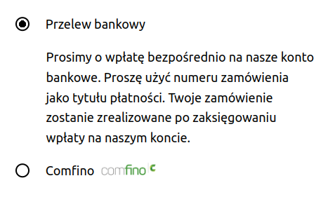

## PLUGIN DOWNLOAD

Download the latest version of the plugin from the website: https://github.com/comfino/WooCommerce/releases

## INSTALLATION

On-line version of the documentation: https://comfino.pl/plugins/WooCommerce/en

Go to the `"Plugins"` tab, then click the `"Add new -> Upload plugin"` button. Select the appropriate module file. The plugin will install automatically.

## CONFIGURATION

The configuration parameters of the module are grouped by categories corresponding to the tabs of the configuration panel: `"Payment settings"`, `"Sale settings"`, `"Widget settings"`, `"Developer settings"`.
The last tab `"Plugin diagnostics"` does not contain any parameters to be set and has an information-diagnostic function. Among other things, it contains a local error log.

Before using Comfino payments, the module must be configured. You can do this by clicking `"Settings"` in the module info panel.

The most important field that must be filled in is the "Production Environment API Key" field from the `"Payment settings"` tab.
In the `"Developer settings"` tab, there is a second key field - `"Test environment API key"`.

Configuration parameter fields:

**PAYMENT SETTINGS**

* **Enable/Disable** - activity status of the Comfino module (visibility on the list of payment methods in the basket)
* **Title** - text displayed on the list of payment methods (default `"Comfino"`)
* **Production environment API key** — a unique access key that allows the module to communicate with the Comfino API (you will receive it from a Comfino representative)
* **Show logo** - visibility status of the Comfino logo next to the title at the list of payment methods (default: enabled)

**SALE SETTINGS**

The tab contains settings related to sales management.

Financial product availability rules (product category filters) enable Comfino payments to be assigned to specific product categories. Category filters are divided into sections corresponding to available methods of financing purchases under the contract concluded with Comfino. Moreover, managing the availability of Comfino payments is only possible for the following types of financial products: "Zero percent installments", "Pay later". If the concluded contract does not include one or all of these items, the tab will contain a list of trees limited to this one financing method or it will contain a list of trees for other types of products from the contract, if the contract does not include the "Zero percent installments" and "Pay later" products.

By default, Comfino payments are available unconditionally for all product types. To disable Comfino for selected product types, uncheck the appropriate categories in the category tree for each type of financial offer and click "Save".

**WIDGET SETTINGS**

**Basic Settings**

* **Widget enable** — promotional widget activation/deactivation switch on the product page
* **Widget key** - a unique access key which enables the widget to communicate with the Comfino API (set automatically when saving the configuration with the correct API key)
* **Widget type** — way of presenting the widget [`Textual widget`, `Graphical widget with banner`, `Graphical widget with installments calculator`]
* **Widget offer type** — type of financing offer promoted [`Zero percent installments`, `Convenient installments`, `Pay later`, `Deferred payments for companies`]

The availability of offer types on the list depends on the individual contract and may differ from that described in the documentation.

**Advanced settings**

* **Widget price element selector** — HTML document element containing the price of the product
* **Widget anchor element selector** — widget container element (widget is embedded in it)
* **Price change detection — container selector** — HTML document element containing a price element directly or indirectly used to track price changes and recalculate offers
* **Price change detection — container hierarchy level** — DOM hierarchy level used to track price changes and recalculate offers
* **Embedding method** — how the widget is oriented relative to the container element [`INSERT_INTO_FIRST`, `INSERT_INTO_LAST`, `INSERT_BEFORE`, `INSERT_AFTER`]
* **Widget initialization code** — JavaScript script to initialize the widget on the product page (making changes not recommended for non-advanced users without JavaScript knowledge)

Detailed information on the operation of the widget and its configuration options can be found in a separate [Comfino widget documentation](https://comfino.pl/widgets/comfino-woocommerce/en).

**DEVELOPER SETTINGS**

* **Test environment** — developer mode activation/deactivation switch
* **Test environment API key** — a unique access key enabling the module to communicate with the Comfino test API

**Note**

Before launching payments on the production store, disable developer mode to block the use of the Comfino payment test environment.

**PLUGIN DIAGNOSTICS**

The tab contains technical information about the plugin and the environment (plugin version, store version, PHP and web server version, etc.).\
It also contains a list of recent errors with a preview of the local error log.

## REMARKS

* The Comfino payment module requires you to set the customer's phone number as required in the process of entering the customer's contact details. The phone number is used to send codes and inform the customer about the status of the transaction, at a later stage of Comfino payment processing. In case of absence of a telephone number, the Comfino payment transaction will end with an error displayed on the store's website.
* The module notification system requires the availability of the HTTP "PUT" method. The module receives information about changes in the status of Comfino transactions and changes the internal order status in WooCommerce accordingly. In case of problems with notifications, check the web server settings in your hosting panel.
* Customer and order data required by the Comfino module:
    * Customer:
        * first name - 2-63 characters
        * last name - 2-63 characters
        * email address - valid e-mail address
        * valid Polish mobile phone number (expected format: xxxxxxxxx, xxx xxx xxx, +48 xxxxxxxxx).
    * Cart:
        * total amount
        * list of products
            * name
            * quantity
            * price
    * Address:
        * street
        * building number
        * apartment number
        * postal code
        * city
        * country code

## SAMPLE CART VIEW WITH A LIST OF PAYMENT METHODS

## COMFINO PROCESS FLOW

