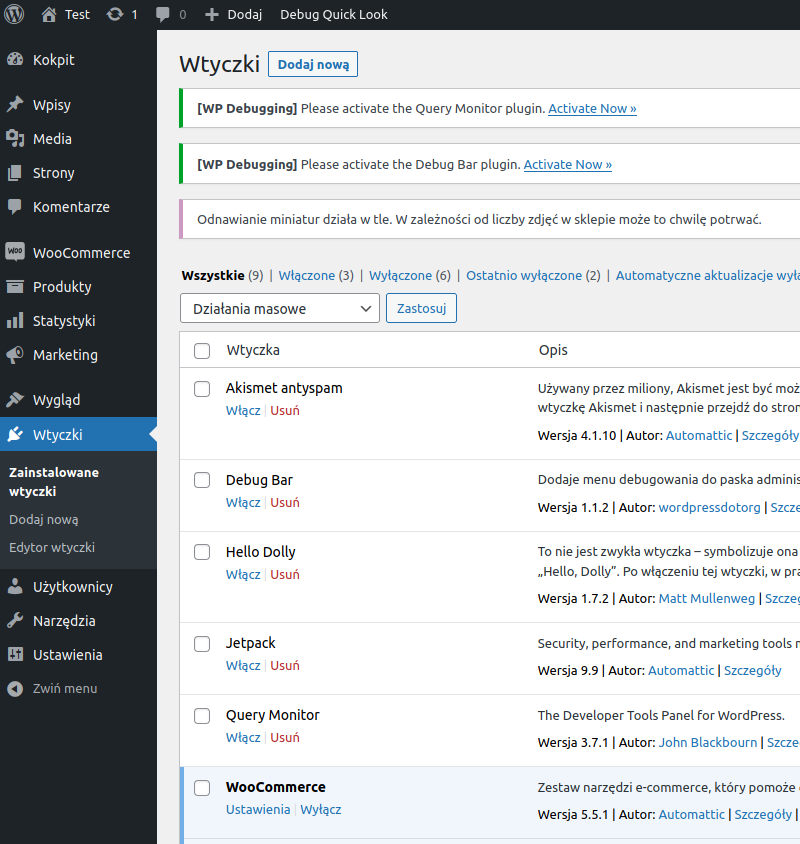
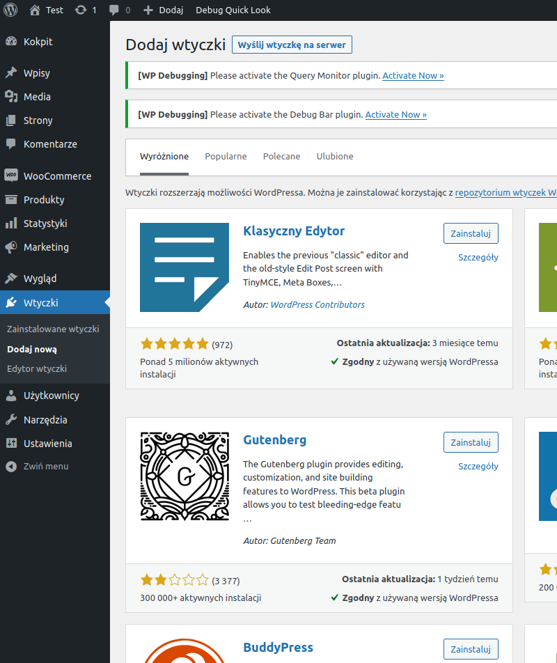
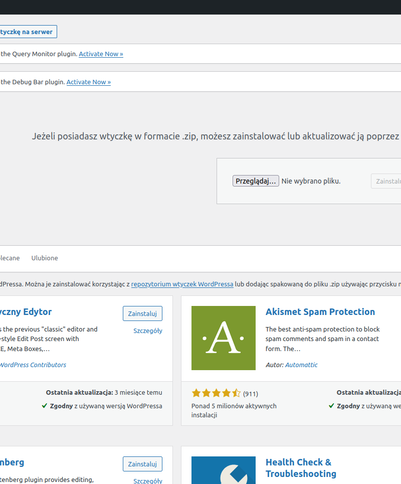
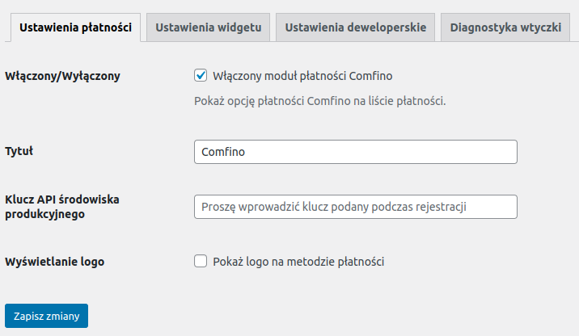
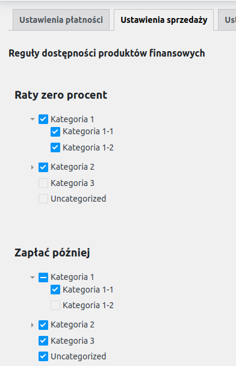
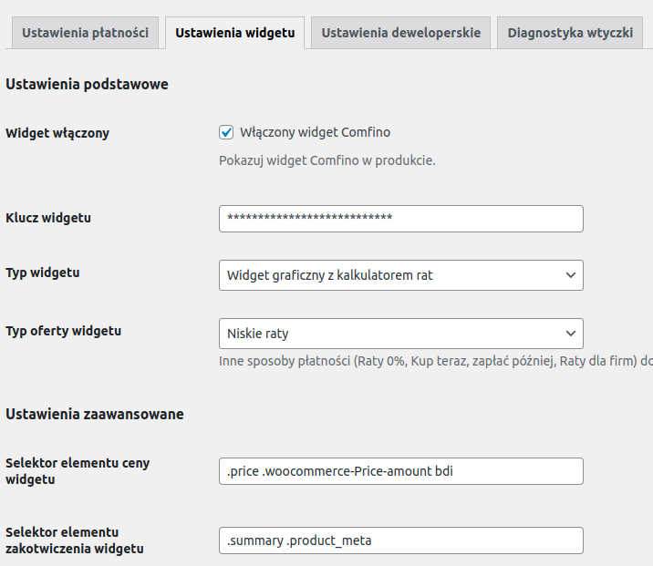
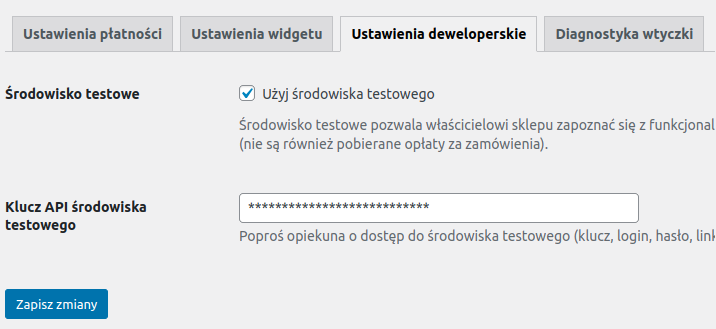
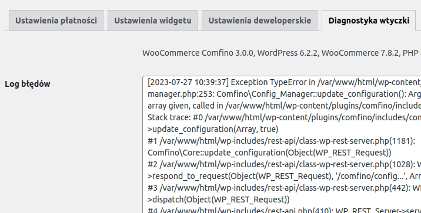
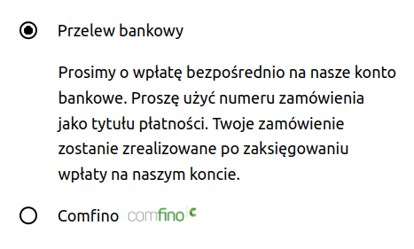
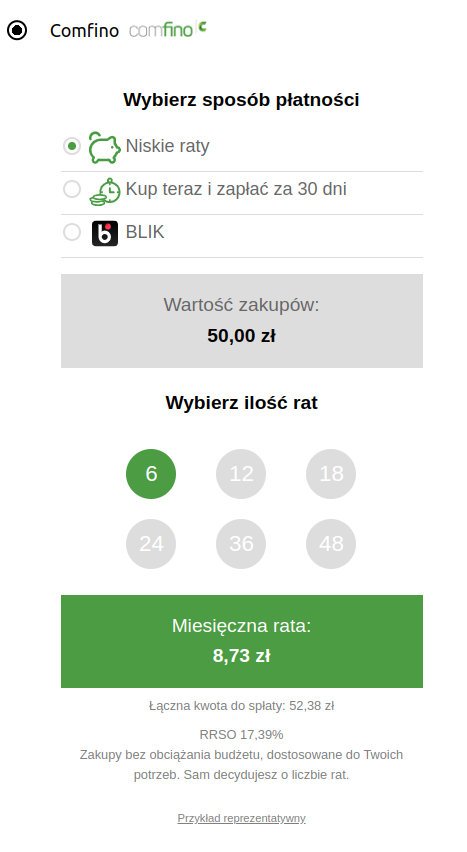

## POBIERANIE WTYCZKI

Pobierz najnowszą wersję wtyczki ze strony: https://github.com/comfino/WooCommerce/releases

## INSTALACJA

Wersja on-line dokumentacji: https://comfino.pl/plugins/WooCommerce/pl

Przejdź do zakładki `"Wtyczki"`, następnie kliknij przycisk `"Dodaj nową -> Wyślij wtyczkę na serwer"`. Należy wybrać odpowiedni plik z modułem. Wtyczka zainstaluje się automatycznie.

## KONFIGURACJA
Parametry konfiguracyjne modułu są pogrupowane kategoriami odpowiadającymi zakładkom panelu konfiguracyjnego: `"Ustawienia płatności"`, `"Ustawienia sprzedaży"`, `"Ustawienia widgetu"`, `"Ustawienia deweloperskie"`.
Ostatnia zakładka `"Diagnostyka wtyczki"` nie zawiera żadnych parametrów do ustawienia i pełni funkcję informacyjno-diagnostyczną. Zawiera między innymi lokalny dziennik błędów (log błędów).

Przed użyciem płatności Comfino, moduł musi zostać skonfigurowany. Możesz to zrobić, klikając `"Ustawienia"` w panelu informacyjnym modułu.

Najważniejsze pole, które musi być uzupełnione, to pole `"Klucz API środowiska produkcyjnego"` z zakładki `"Ustawienia płatności"`.
W zakładce `"Ustawienia deweloperskie"` znajduje się pole drugiego klucza - `"Klucz API środowiska testowego"`.

Pola parametrów konfiguracyjnych:

**USTAWIENIA PŁATNOŚCI**

* **Włączony/Wyłączony** — status aktywności modułu Comfino (widoczność na liście metod płatności w koszyku)
* **Tytuł** — tekst wyświetlany na liście metod płatności (domyślnie `"Comfino"`)
* **Klucz API środowiska produkcyjnego** — unikalny klucz dostępowy umożliwiający komunikację modułu z API Comfino (otrzymasz go od przedstawiciela Comfino)
* **Wyświetlanie logo** — status widoczności logo Comfino obok tytułu na liście metod płatności (domyślnie: włączone)

**USTAWIENIA SPRZEDAŻY**

Zakładka zawiera ustawienia dotyczące zarządzania sprzedażą.

Reguły dostępności produktów finansowych (filtry kategorii produktowych) umożliwiają przypisanie płatności Comfino do określonych kategorii produktów. Filtry kategorii są podzielone na sekcje odpowiadające dostępnym metodom finansowania zakupów w ramach umowy zawartej z Comfino. Ponadto zarządzanie dostępnością płatności Comfino jest możliwe tylko dla następujących typów produktów finansowych: "Raty zero procent", "Zapłać później". Jeśli zawarta umowa nie zawiera jednej z tych pozycji lub wszystkich, to zakładka będzie zawierała listę drzew ograniczonych do tej jednej metody finansowania lub będzie zawierać listę drzew dla pozostałych typów produktów z umowy, w przypadku braku obecności w umowie produktów "Raty zero procent" i "Zapłać później".

Domyślnie płatności Comfino są dostępne bezwarunkowo dla wszystkich typów produktów. W celu wyłączenia Comfino dla wybranych typów produktów należy odznaczyć odpowiednie kategorie w drzewie kategorii dla każdego typu oferty finansowej i kliknąć "Zapisz".

**USTAWIENIA WIDGETU**

**Ustawienia podstawowe**

* **Widget włączony** — przełącznik aktywacji/deaktywacji widgetu promocyjnego na stronie produktu
* **Klucz widgetu** — unikalny klucz dostępowy umożliwiający komunikację widgetu z API Comfino (ustawiany automatycznie przy zapisie konfiguracji z poprawnym kluczem API)
* **Typ widgetu** — sposób prezentacji widgetu [`Widget tekstowy`, `Widget graficzny z banerem`, `Widget graficzny z kalkulatorem rat`]
* **Typ oferty widgetu** — typ promowanej oferty finansowania [`Raty zero procent`, `Niskie raty`, `Zapłać później`, `Odroczone płatności dla firm`]

Dostępność typów ofert na liście jest uzależniona od indywidualnej umowy i może różnić się od tej opisanej w dokumentacji.

**Ustawienia zaawansowane**

* **Selektor elementu ceny widgetu** — element dokumentu HTML zawierający cenę produktu
* **Selektor elementu zakotwiczenia widgetu** — element kontenera widgetu (w nim jest osadzany widget)
* **Wykrywanie zmian ceny — selektor kontenera** — element dokumentu HTML zawierający w sobie element ceny bezpośrednio lub pośrednio używany do śledzenia zmian cen i przeliczania ofert
* **Wykrywanie zmian ceny — poziom hierarchii kontenera** — poziom hierarchii DOM używany do śledzenia zmian cen i przeliczania ofert
* **Metoda osadzania** — sposób orientacji widgetu względem elementu kontenera [`INSERT_INTO_FIRST`, `INSERT_INTO_LAST`, `INSERT_BEFORE`, `INSERT_AFTER`]
* **Kod inicjalizacji widgetu** — skrypt JavaScript inicjalizujący widget na stronie produktu (wprowadzanie zmian niezalecane dla niezaawansowanych użytkowników bez znajomości JavaScript)

Szczegółowe informacje o działaniu widgetu i jego opcjach konfiguracyjnych znajdziesz w osobnej [dokumentacji widgetu Comfino](https://comfino.pl/widgets/comfino-woocommerce/pl).

**USTAWIENIA DEWELOPERSKIE**

* **Środowisko testowe** — przełącznik aktywacji/deaktywacji trybu deweloperskiego
* **Klucz API środowiska testowego** — unikalny klucz dostępowy umożliwiający komunikację modułu z testowym API Comfino

**Uwaga**

Przed uruchomieniem płatności na sklepie produkcyjnym, wyłącz tryb deweloperski, aby zablokować użycie środowiska testowego płatności Comfino.

**DIAGNOSTYKA WTYCZKI**

Zakładka zawiera informacje techniczne o wtyczce i środowisku (wersja wtyczki, wersja sklepu, wersja PHP i serwera www, itp.).\
Zawiera też listę ostatnich błędów wraz z podglądem lokalnego dziennika błędów (log błędów).

## UWAGI

* Moduł płatności Comfino wymaga ustawienia numeru telefonu klienta jako wymaganego w procesie wprowadzania danych kontaktowych klienta. Numer telefonu jest używany do przesyłania kodów i informowania klienta o statusie transakcji, na dalszym etapie procesowania płatności Comfino. W przypadku braku numeru telefonu transakcja płatnicza Comfino zakończy się błędem wyświetlonym na stronie sklepu.
* System notyfikacji modułu wymaga dostępności metody HTTP "PUT". Moduł otrzymuje informacje o zmianach statusu transakcji Comfino i stosownie zmienia wewnętrzny status zamówienia w WooCommerce. W przypadku problemów z notyfikacjami należy sprawdzić ustawienia serwera www w Twoim panelu hostingu.
* Dane klienta i zamówienia wymagane przez moduł Comfino:
    * Klient:
        * imię — 2-63 znaków
        * nazwisko — 2-63 znaków
        * e-mail — poprawny adres e-mail
        * telefon — poprawny polski numer komórkowy (oczekiwany format: xxxxxxxxx, xxx xxx xxx, +48 xxxxxxxxx).
    * Koszyk:
        * kwota koszyka
        * lista produktów
            * nazwa
            * ilość
            * cena
    * Adres:
        * ulica
        * numer budynku
        * numer mieszkania
        * kod pocztowy
        * miasto
        * kod kraju

## PRZYKŁADOWY WYGLĄD KOSZYKA Z LISTĄ METOD PŁATNOŚCI

## PRZEBIEG PROCESU COMFINO

